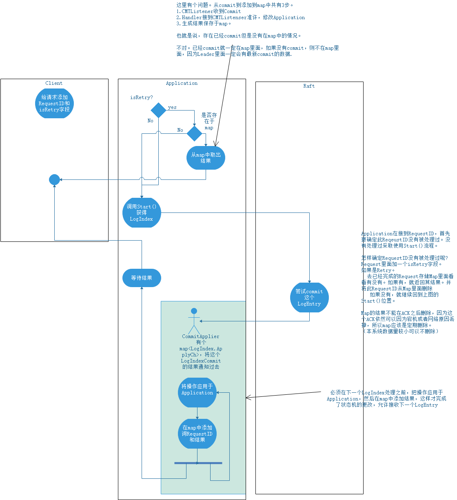

# 1.TestA
## 1.1 Part1 20221227 started
op的字段:
1.操作类型
2.待操作key
3.待操作的value 
Get-server设计：
    1.封装成OP
    2.调用raft.Start()，获取logIndex
    3.等待raft commit到此logIndex。
    commit到此LogIndex之后，立刻加读锁，进行读取
Putappend-server设计：
    1.封装成OP
    2.调用raft.Start()，获取logIndex
    3.等待raft commit到此logIndex。
    commit到此LogIndex之后，立刻加写锁，进行写入
加锁是为了维持系统的一致性，不能在读取的时候值突然改变。
这里最好是个读写锁。而且这个读写锁应该是只针对这个key的。对其他key的读写不受此key操作的影响。 
Clerk设计
Clerk要实现要求的
1.server failure，重新请求，不再重复执行此命令。-> 这个理解为状态机的幂等性。如果状态机不为raft过滤掉的话，raft就认为这是两个command。所以会执行两次。为每个Client请求加一个requestID(Integer)。
状态机的幂等性的解决见图

2.command是幂等的 -> 为每个op加一个编号，k,v记录这个编号记为version。如果操作的编号小于当前key-value的version，就不执行。
这里的version就直接使用LogIndex就可以。

3.op应该有个ID，让handler知道这个apply的op是不是自己正在等待的op。

AddtionalRequirements:
1.One problem you'll face is that a Clerk may have to send an RPC multiple times until it finds a kvserver that replies positively. If a leader fails just after committing an entry to the Raft log, the Clerk may not receive a reply, and thus may re-send the request to another leader. Each call to Clerk.Put() or Clerk.Append() should result in just a single execution, so you will have to ensure that the re-send doesn't result in the servers executing the request twice.
2.记住Leader，防止每一次都要找。
3.

TODO：
思考的是，application中，需要分布式保存的状态有哪些？
1.maxIDs和lastestResp
2.disk(即storage)

20230210
感受到了在日志打印RequestID的作用，使用一个RequestID就可以追踪一个Request所有的处理流程。刚开始没有这么做，在处理bug的时候难受地一笔。
## 1.2 Part2

# 2.TestB